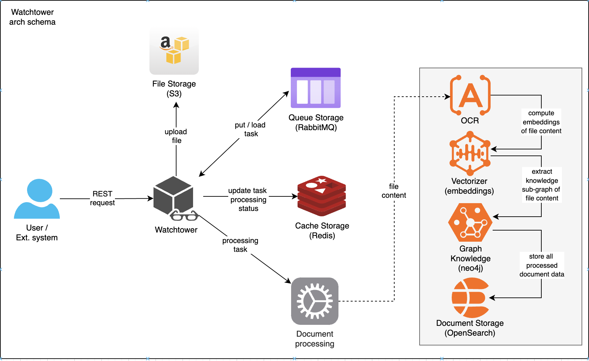

# Watchtower Metaverse project

## Overview

Watchtower is a project designed to monitor S3 file events for further AI processing. This service is been designed
for listening creating/uploading new files into cloud storage to download it and start processing to extract text content,
build and store knowledge graph of content entities and store to ELK system.



### Domain

There are following domains:

```
domain
   |----> File Storage (core)
   |        |----> Bucket
   |        |       |----> Context: bucket management into s3 object storage
   |        |       |----> Services: IBucketManager
   |        |----> Object
   |                |----> Context: object management into s3 object storage
   |                |----> Services: IObjectManager
   |
   |----> Task Processing (support)
   |        |----> Task
   |        |       |----> Context: task management into storage
   |        |       |----> Services: ITaskStorage
   |        |----> Message
   |                |----> Context: task queue management
   |                |----> Services: ITaskQueue
   |
   |----> User Resource (generic)
   |        |----> Resource (unimplemented yet)
   |                |----> Context: User resource checking
   |                |----> Services: IUserResourceManager
   |
 
```

And there are usecases:

```
usecase
   |----> Storage Use Case
   |        |----> CRUD of bucket and object
   |        |----> generate share URL of stored object
   |        |----> check that user has access to ressource 
   |        |----> upload file to storage and create new task processing event
   |
   |----> Task Use Case
   |        |----> task management into storage and queue
   |
   |----> Orchestrator (process)
   |        |----> combined both usecases to common upload and processing file pipeline
   |        |----> task processing stages like recognizing and indexing by uploading files
```

There is context map:

```
           +----------------+
           |  Orchesttator  |
           +--------+-------+
                    |
        ┌───────────┴───────────┐
        ▼                       ▼
+----------------+         +-------------+
| StorageUseCase |         | TaskUseCase |
+----------------+         +-------------+
        |                        |
        ▼                        ▼
+----------------+         +-------------+
| Storage Domain |         | Task Domain |
+----------------+         +-------------+


```

Context data flow:

```
HTTP Request
     │
     ▼
HTTP Handler (ServerState)
     │
     ▼
Orchestrator (orchestrator)
    ├── StorageUseCase (application)
    │       │
    │       ▼
    │    Storage (domain)
    │
    └── TaskUseCase (application)
            │
            ▼
          Task (domain)

```

## Features

 - S3 event monitoring - listen for file creation and copy events.
 - Text extracting - extract text from PDF, DOCX, and TXT files by OCR and LLM.
 - Embeddings computing - computing file text content embeddings by pre-trained model for semantic-search. 
 - ELK integration: Store extracted text, embeddings, and metadata into ELK based systems like elastic and opensearch.
 - Scalable architecture - stateless service that is guarantied by RabbitMQ and Redis services.

## Quick Start

1. Clone the repository:

    ```shell
    git clone <repository-url>/watchtower.git
    cd watchtower
    ```

2. Build docker image from sources:

    ```shell
   docker build -t watchtower:latest .
    ```

3. Edit configs file `configs/production.toml` to launch docker compose services

4. Start the application using Docker Compose:

    ```shell
    docker compose up -d watchtower <other-needed-services>
    ```

5. The application should now be running. Check the logs with:

    ```shell
    docker compose logs -f
    ```
